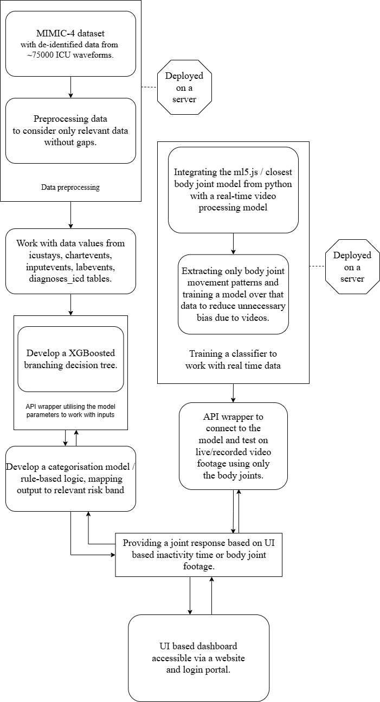

# Deep-vein-thrombosis
##### Elements may be subject to change.
# 🏥 AI-Driven Hemodynamic Risk Stratification System  
### Early Detection of Perfusion Instability & Immobility-Associated Complications

---

## 📌 Problem

Hospitalized and homebound patients are at increased risk of:

- Deep Vein Thrombosis (DVT)
- Pressure injuries
- Acute Kidney Injury (AKI)
- Perfusion-related organ dysfunction

These complications are often driven by:

- Sustained hypotension  
- Hemodynamic instability  
- Poor mobility compliance  
- Inadequate repositioning  

Current monitoring systems are:

- Manual  
- Inconsistently documented  
- Reactive rather than predictive  
- Difficult to audit at scale  

---

## 🎯 Objective

Develop a **non-invasive, multimodal AI system** that:

- Models hemodynamic instability using ICU physiological data  
- Tracks patient mobility and repositioning patterns  
- Generates continuous patient-level risk scores  
- Provides explainable, real-time clinical decision support  

The system shifts monitoring from **static threshold alerts** to **dynamic predictive risk stratification**.

---

## 🧠 Conceptual Framework

Rather than directly predicting DVT (a multifactorial condition), the system models:

> **Sustained hypotension and perfusion impairment**  

as physiologically grounded precursors to downstream complications such as:

- Thrombotic risk  
- Acute kidney injury  
- Pressure-related tissue injury  

This ensures:
- Clinical validity  
- Alignment with available vital sign data  
- Reduced speculative inference  

---

# 🏗 System Architecture

The system consists of two primary pipelines:

---

# 1️⃣ Hemodynamic Risk Prediction Pipeline

## Data Sources

- MIMIC-IV (structured ICU dataset)
- MIMIC-IV Waveform Database
- eICU dataset

### Available Vitals

- Heart Rate (HR)
- Systolic / Diastolic / Mean Arterial Pressure (SBP / DBP / MAP)
- Respiratory Rate (RR)
- SpO₂
- Temperature
- Arterial waveform data (where available)
- Laboratory markers (lactate, creatinine, WBC, etc.)

---

## Preprocessing

- Removal of incomplete ICU stays  
- Temporal alignment of vitals  
- Feature extraction from:
  - `icustays`
  - `chartevents`
  - `inputevents`
  - `labevents`
  - `diagnoses_icd`

Derived features include:

- MAP trend slopes  
- HR variability proxies  
- Hypotension duration windows  
- Lactate progression markers  

---

## Model Development

- Supervised learning models (e.g., XGBoost)
- Branching decision tree architecture
- Continuous patient-level risk scoring

### Outputs

- Risk band classification  
- Probability of sustained hypotension  
- Perfusion instability risk score  

---

## Explainability Layer

- Feature attribution methods (e.g., SHAP)
- Identification of physiological drivers
- Clinician-interpretable outputs

---

# 2️⃣ Movement Detection & Compliance Pipeline

## Pose Extraction

- ml5.js / pose-based joint detection  
- Real-time or recorded video input  
- Extraction of skeletal joint coordinates only  
- No raw video storage  

---

## Feature Engineering

- Movement frequency  
- Joint displacement magnitude  
- Repositioning interval detection  
- Inactivity duration tracking  

Bias mitigation:

- Model trained on skeletal coordinates only  
- Removal of demographic visual features  

---

## Movement Risk Modeling

- Classifier trained on joint movement patterns  
- Real-time inference capability  
- Mobility compliance scoring  

---

# 🔄 Risk Fusion Layer

The system integrates:

- Hemodynamic instability risk  
- Movement/inactivity risk signals  

To generate:

> A unified patient-level deterioration risk response

This enables:

- Multi-factor deterioration tracking  
- Combined physiological + behavioral modeling  
- Earlier intervention opportunities  

---

# 🖥 Clinical Dashboard

Web-based dashboard providing:

- Continuous risk score visualization  
- Risk band categorization  
- Movement compliance metrics  
- Physiological trend graphs  
- Explainability outputs  

Designed for:

- Workflow compatibility  
- Audit-readiness  
- Decision-support integration  

---

# 📦 Core Components

- Hemodynamic predictive ML model  
- Movement detection model  
- Continuous risk scoring engine  
- Compliance analytics dashboard  
- Explainability module  
- API-based deployment framework  

---

# 📊 Deliverables

- Trained predictive ML model  
- Risk scoring engine prototype  
- Mock clinical dashboard  
- Evaluation metrics report  
- Deployment feasibility assessment  

---

# ⚖ Ethical & Translational Considerations

## Risks

- ICU dataset bias  
- Limited generalizability to home settings  
- False alarm burden  
- Overreliance on automated scoring  

## Mitigation Strategies

- Transparent feature attribution  
- Clinical validation workflows  
- Conservative alert threshold tuning  
- Modular deployment architecture  

---

# 👥 Team Structure

Organizational Model: **Hybrid Functional + Cross-Functional Pods**

## Executive Roles

- **Technical Architecture & Integration Lead** – Christoph Johnson  
- **AI & Predictive Modeling Lead** – Shaun Karakkattu  
- **Coding & Systems Engineering Lead** – Aniket Kuyate  
- **Clinical Research & Risk Framework Lead** – Nicole Saad  
- **Project Manager & Website Lead** – Ela Rees  

---

## Cross-Functional Pods

### Core Model Development
Christoph + Shaun + Aniket  
Focus: Data → Model → Backend Integration  

### Clinical Validation & AI Alignment
Nicole + Shaun + Christoph  
Focus: Medical grounding & feature legitimacy  

### Systems & Interface Integration
Aniket + Ela + Christoph  
Focus: API → Dashboard → UX  

### Impact & Governance
Nicole + Ela + Shaun  
Focus: Clinical impact, scalability, bias evaluation  

---

# 🚀 Impact

- Reduced pressure injury incidence  
- Improved nursing workflow compliance  
- Potential adaptation for home monitoring  
- Audit-ready reporting for healthcare systems  

---

# 🛠 Tech Stack

**Backend**
- Python
- XGBoost
- FastAPI / Flask

**Frontend**
- JavaScript
- ml5.js
- Web-based dashboard framework

**Deployment**
- Server-hosted APIs
- Modular, scalable architecture

---

# 📌 Status
Currently discussing project feasibility within proposed time frame.
